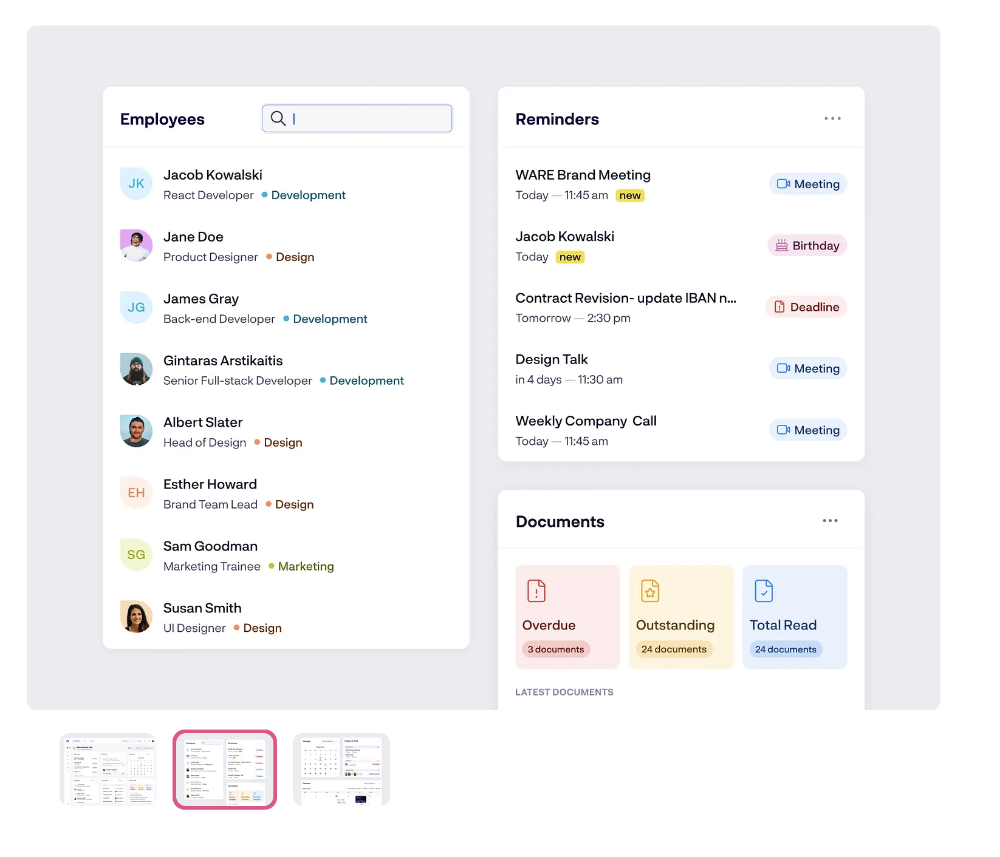
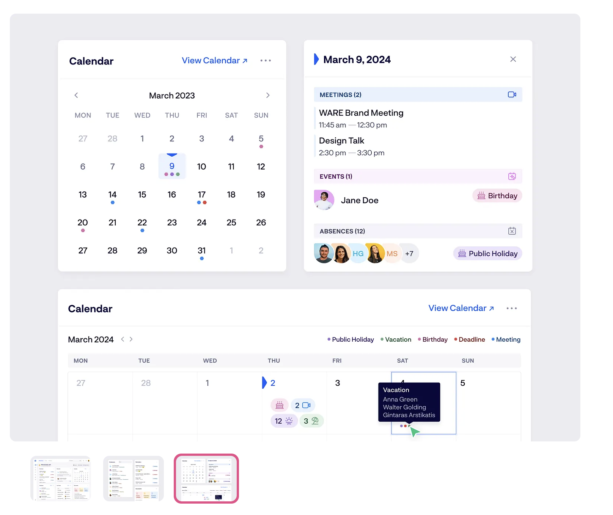
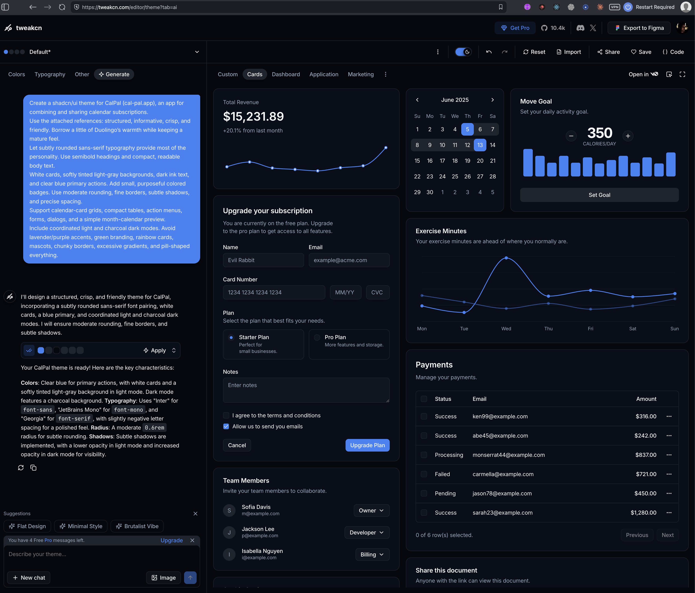

# CalPal theme: rounded typography, structure and purposeful color

## Original thought

nah, i dont know, that tools not not great. i think a better strategy is by first installing shadcn the correct way and then you handle the theme creation. first install what's needed in order for the setup we discussed, then we can handle the theme creation later. [$capture](/Users/christian/dev/ai-skills/capture/SKILL.md) the ideas we have for our theme including the description for font, colors and the references i gave you

Earlier wording from the same discussion:

> im not sure i want that lavender accents. tweak the prompt a little more for these kinds of designs:
>
> https://www.duolingo.com - playful but i'd like slightly more "seriousness" to it
> image 1: nice with colors but this is too busy
>
> i think the fonts could play a huge role. maybe keep the "seriousness" behind the quite regular shadcn style but add this playfulness with the rounded fonts?

> this is also nice. this one has colors but at the same time a little "strict", "sharp" and informative and structured

> also it wont be green.

## Context

The app name is CalPal and the user bought cal-pal.app. The user now wants to install the UI foundation first and defer custom theme creation. The generated tweakcn result was not satisfying; do not treat its token values or font selection as approved.

### Overall direction

Minimal, useful, easy to scan, friendly and subtly playful, while professional and structured. Avoid a kindergarten-sign aesthetic and the busy learning-dashboard reference. Keep familiar shadcn component structure; introduce personality through typography and purposeful accents rather than decoration or a rainbow of card backgrounds.

### Font ideas

The user wants rounded typography to play a significant role. Suggested starting points were Nunito and Nunito Sans, not a final selection. Explore a subtly rounded sans-serif with readable letterforms, confident semibold headings and regular-weight body text. Tables, dates, numbers and form labels should stay compact and legible. Avoid overly bubbly letters, oversized headings and excessive boldness. The generated result selected Inter, which did not realize the proposed rounded-font direction.

### Color ideas

No green brand palette. Lavender accents are not preferred. Exact colors remain open. The drafted prompts proposed neutral white or warm-white cards, a pale gray background, dark ink text and clear blue primary actions. Use several restrained supporting colors for meaningful statuses and categories, with soft tinted fills and darker matching labels. Mostly neutral surfaces and distinct accents should retain structure and personality.

An assistant-proposed palette used blue for primary actions/selection, teal for healthy states, amber for pending/warnings, coral for errors/destructive actions, and occasional soft rose for category highlights. These mappings are exploratory, not approved requirements. The latest generated theme leaned heavily on blue, including charts, and did not convey enough purposeful supporting color. Dark-mode ideas include neutral charcoal backgrounds, visibly lighter card surfaces and restrained colored highlights, with comfortable contrast. Avoid tinting every surface blue.

### Other treatment

Moderate corner rounding, fine borders, subtle separators and shadows, consistent spacing and precise alignment. Avoid mascots, gamification, chunky borders, excessive gradients and pill-shaped everything. The theme should support the current design direction: responsive calendar cards, source/invitation tables, ellipsis action menus and consistent forms/overlays, including a simple read-only calendar-preview modal.

### References supplied by the user

- [Duolingo](https://www.duolingo.com): playful and approachable, with more seriousness desired for CalPal.
- Learning dashboard: appealing use of colors, but too busy.
- Structured dashboard and cards: liked for their color, sharpness, informative hierarchy and organization.
- Calendar reference: compact month grid with colored event markers and selected-day information.
- Generated tweakcn result: retained as a comparison; not a selected design.

The supplied screenshots are copied alongside this capture for later use.

